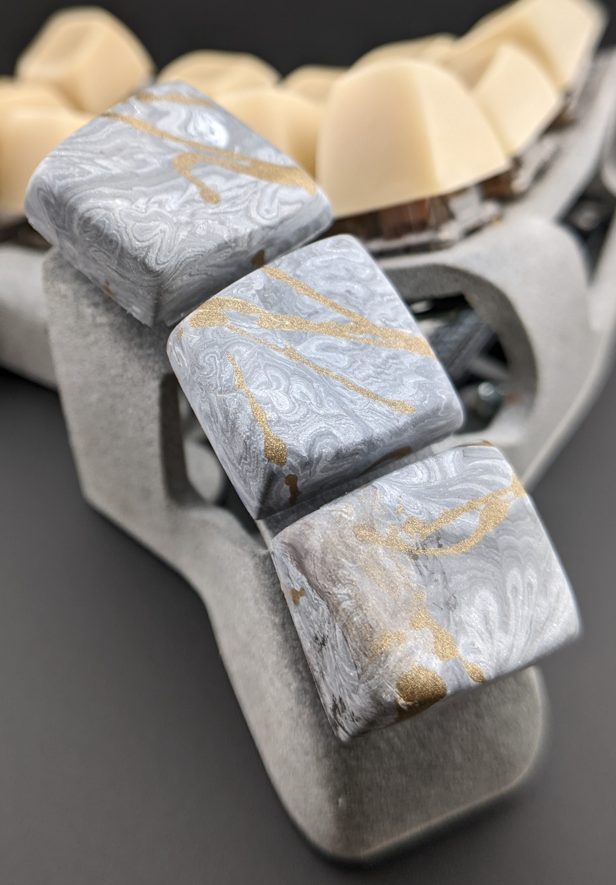
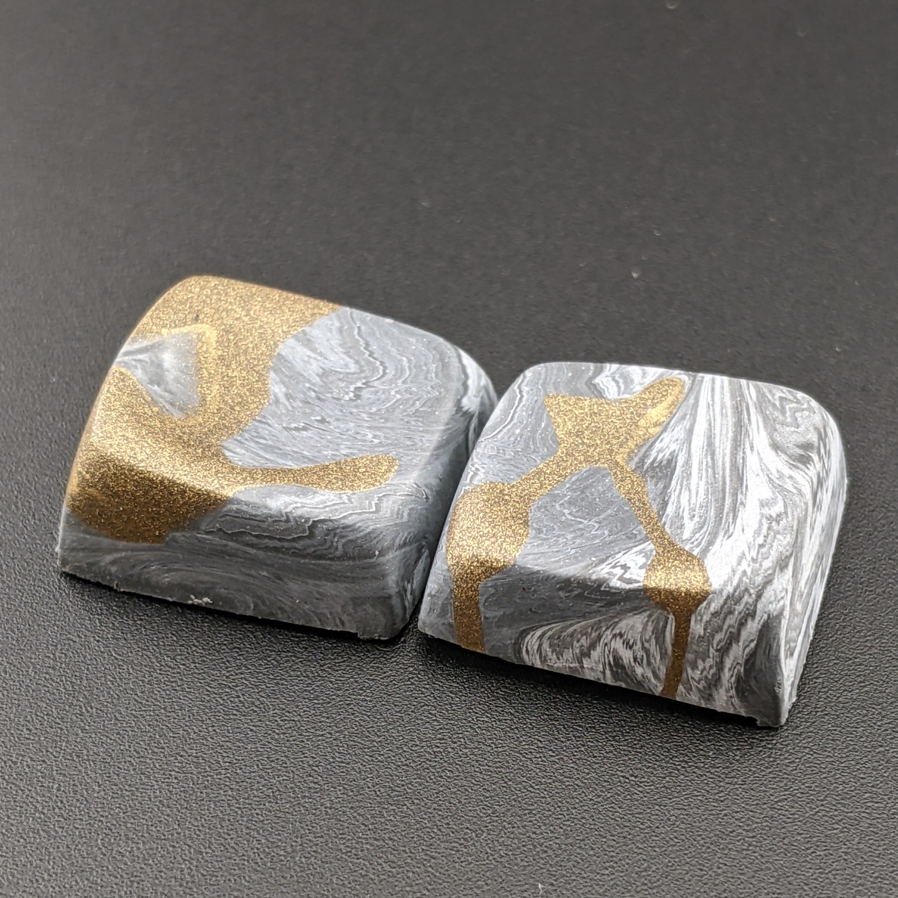
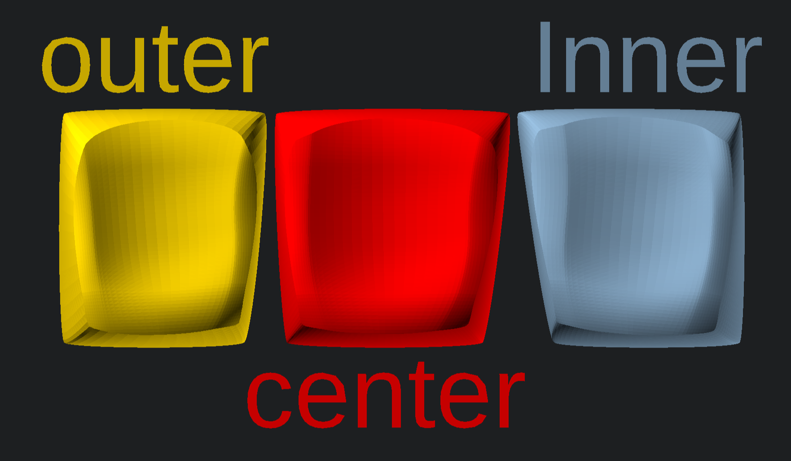
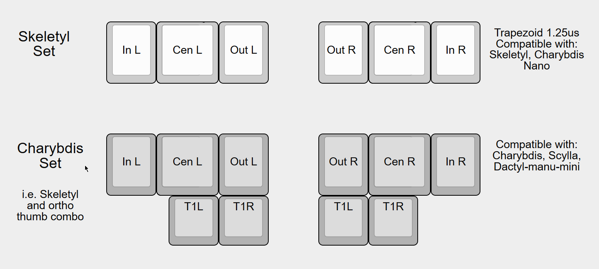

# Bezier Curve DES

## What is it for?
Keycap sets for [Skeletyl Thumb cluster](https://github.com/Bastardkb/Skeletyl) and left and right sided 1u Pair.
Parametric transformation of the Bézier curve enables a smooth transition from concave to convex in the keycap’s dishing.

## How to generate stl
* make sure OpenSCAD is up to date.
* requires [scad-utils](https://github.com/OskarLinde/scad-utils) and [BOSL2](https://github.com/BelfrySCAD/BOSL2) libraries
* select keycap you want to render by changing KeyID value
* edit parameters to your desire
* change KeyID to corresponding Parameter ID
* press F5 to review
* press F6 to render
* press F7 to export as STL

## Recommended Layouts

### Right side key orientation

### BastardKB Layout guide

